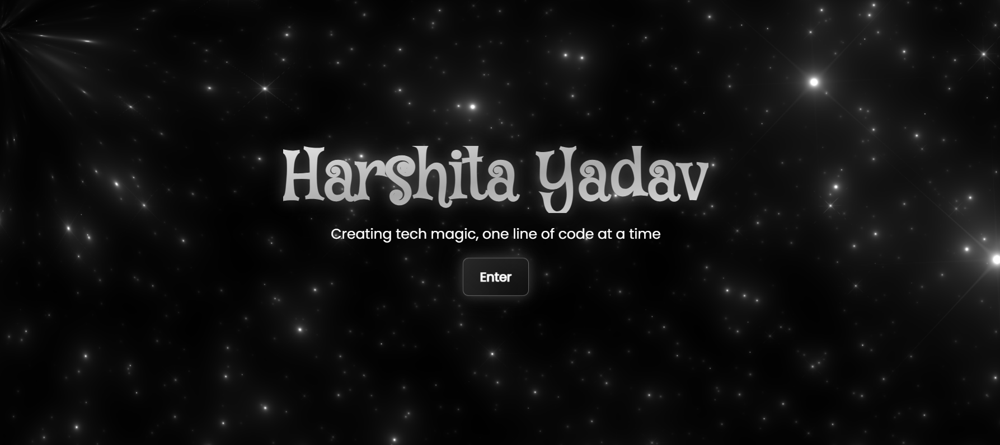

# 🖥️ Portfolio Website

**Live:** [harshitayadavv-portfolio.vercel.app](https://harshitayadavv-portfolio.vercel.app)

A fully responsive **personal portfolio website** built to showcase my projects, skills, and achievements in an elegant and developer-friendly way.

---

## 🚀 Overview
This project highlights my journey as a developer, designed to give recruiters and collaborators an interactive overview of my work and personality.

---

## 🧩 Features
- Responsive and modern UI using **React + Tailwind CSS**
- Smooth animations and transitions
- Dynamic project cards and tech stack badges
- Integrated contact form and social links
- Hosted on **Vercel** for blazing-fast performance

---

## 🛠️ Tech Stack
- **Frontend:** React.js, Tailwind CSS  
- **Deployment:** Vercel  
- **Version Control:** GitHub  

---

## 📷 Preview

---

## 🔗 Repository
[View on GitHub](https://github.com/harshitayadavv/Portfolio)
